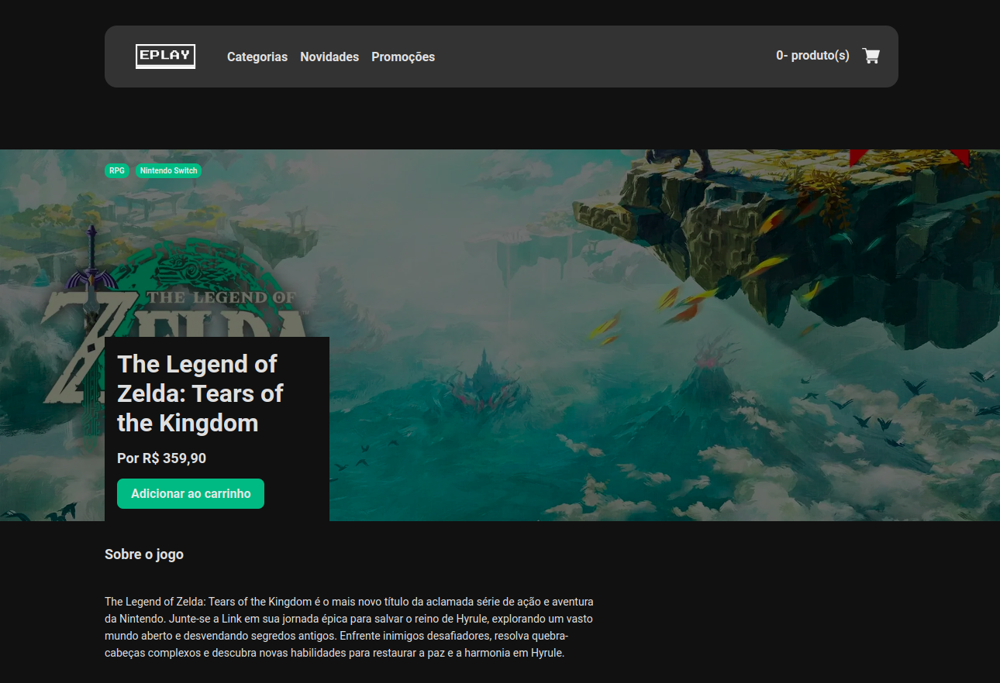

# Eplay
Eplay é uma loja fictícia de jogos desenvolvida como parte do curso de Desenvolvedor Full Stack Python oferecido pela EBAC - Escola Britânica de Artes Criativas. O projeto utiliza tecnologias modernas, como React e TypeScript, para criar uma experiência de usuário dinâmica e interativa. Para o gerenciamento de estado, é utilizado o Redux, facilitando o consumo de APIs e a manutenção dos estados globais da aplicação. A navegação é gerenciada pelo React Router DOM, que organiza as rotas de maneira eficiente, os formulários foram construídos com Formik e Yup, além de conter máscaras nos campos aplicadas pelo React Input Mask.

## Tecnologias usadas
**Setup**
 
&nbsp;
&nbsp;
&nbsp;
&nbsp;
 
**Controle de css**
 
&nbsp;
 
**Formulários**
 

 

## Link Demo: [Next Finance](https://eplay-two-livid.vercel.app/)

  

